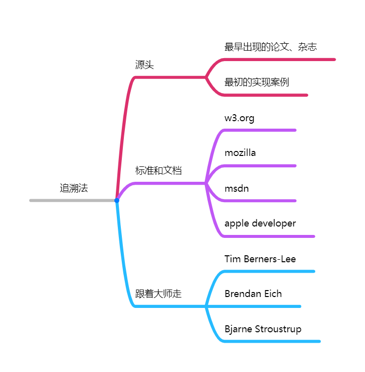
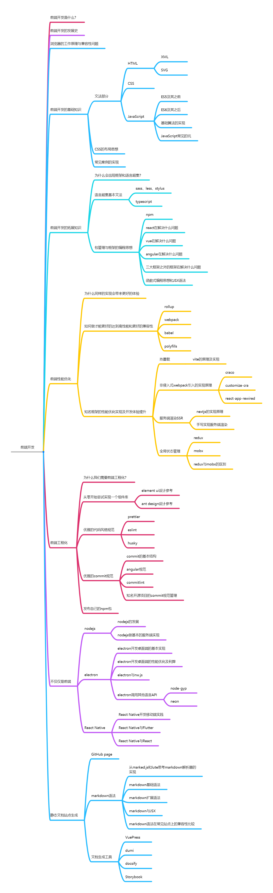

# 第一周学习笔记

## 直播课学习思想

> 追溯法思想

知识点、语法和新的语法糖及实现方式都有一个发展的过程，无论是哪一个学科，学科的发展都是一个过程，并且在过程中日趋完善。新的知识点是永远不可能学完的，在es6的标准中新的语法很多，其中很多的语法都是在之前标准中发现问题的解决。在阅读《JavaScript高级编程》这本书的过程中，意识到了为什么JavaScript这门语言为何看起来是如此的难学。在之后的ecmascript标准中，异步编程和通过链式调用解决“回调地狱”的思想远比所给的语法糖的学习要重要很多。听过winter老师好几场与大佬的访谈，对于JavaScript这门语言的理解逐渐深刻，过去学过很多编程语言的文法，发现语言虽然语法不尽相同，但是设计思想有差异也有异曲同工。

知识是不可能学完的，面试题也是不可能做完的。在第一次面试字节跳动实习生的时候，开始意识到语言本身的基础能力远比框架要重要很多。陆陆续续学过ToyReact和Fiber的实现思想，发现其中设计思想很妙，如何减少DOM的直接操作导致的性能损耗，怎么更好的优化用户体验。在使用第三方npm包和阅读部分源码的过程中，学到了很多的编程思想而与怎么使用框架是无关的。面试官说的很对，少写业务代码，要提高自己编程思想这项能力。

追溯法其实是很好的体现了成长的过程，要思考的不是怎么去写，而是为什么会这么写。作为非科班物理系学生对这一点深有体会，如何去推导和优化一些问题，如何去做得更好，而不仅仅是停留在实现的层面。

标准和文档是每一个程序员都会关注的东西，但是跟着大佬走和溯源其实更重要。标准和文档不过是一种形式的教科书而已，而学到的东西真的理解和记住的会有多少呢？其实并不会很多，文档读的再多都不如手写代码多过几遍的理解深刻。程序员的差距体现在不仅仅是实现的速度，实现的速度是一次又一次的经验积累，但如何为何要这么去实现，如何去思考发展更重要。跟着大师走，同时也需要对自己定位有清晰的认识，在知乎上关注过数个前端的大佬，有来自阿里的，也有腾讯和字节跳动的等，用过阿里的框架，用过Facebook的框架，也用过京东的框架。给某些开源的小项目提过issue也在自己能力范围内PR过。关注大佬的关注点，才可以更好的把握前端也好、后端也罢的发展趋势，更好的让自己去成长和提升。

winter老师提到的工程成就和业务成就，在自己想做一些事情的时候体会过。自己的coding的能力还需要不断地提升，同时的项目管理能力及产品思想也需要提升。在主导一个项目从0开始的时候，什么是急需做的事情，什么是次要的事情会很影响开发的效率。花很多时间做的事情是不是必要的，考核的标准究竟是什么？winter老师所说的阿里的指标，让我思考了很久。很多事情不是一个人就可以做好的，怎么去与不同专长的同学沟通，怎么去更高效率去解决问题真的很重要。在自己开发论坛的时候，参考过CSDN、简书、掘金、思否等等的站点，参考过很多的第三方依赖，如何使不同层次和不同方向的同学快速稳定的加入同一个项目的开发？如何让代码更规范？如何让体验更好？如何让commit更规范？这些问题其实远超过了编码本身这件事情，但是想提高又不得不去解决，成长的道路很长。用过prettier、eslint、husky、git hooks、commitlint等，coding虽然是自由的，但还需要标准来约束来提高开发的效率和产品的质量。

## 如果自己写一本前端开发的书

## TicTacToe游戏的实现及其思考

### 实现基本思路

1. 绘制棋盘
2. 利用数组存储棋盘的值
3. 给棋盘添加点击事件
4. 添加胜负判断函数
5. 添加形势预判函数
6. 添加最佳选择函数和计算函数实现AI能力

### 涉及的语法积累

- [x] 棋盘可以通过一维数组的方式存储，然后修改遍历方式
- [x] 使用`?:`语法进行赋值操作
- [x] 胜利情况可以遍历判断是否与落子相等来判断胜负情况
- [x] 深拷贝可以通过自带的`JSON`的`stringify`和`parse`实现，**可以使用Object.create()实现一维数组的深拷贝**
- [x] 使用label语法跳出二层循环
- [x] 利用3的加减运算实现1和2值的来回交换
- [x] 使用`inline-block`和`vertical-align`进行布局

### 遇到问题的解决

- [x] 落子之后可以修改的情况
